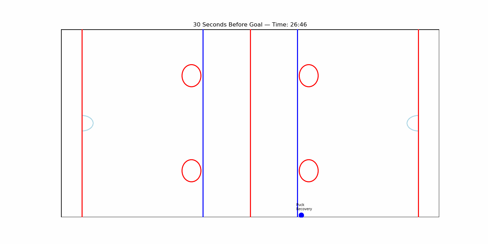
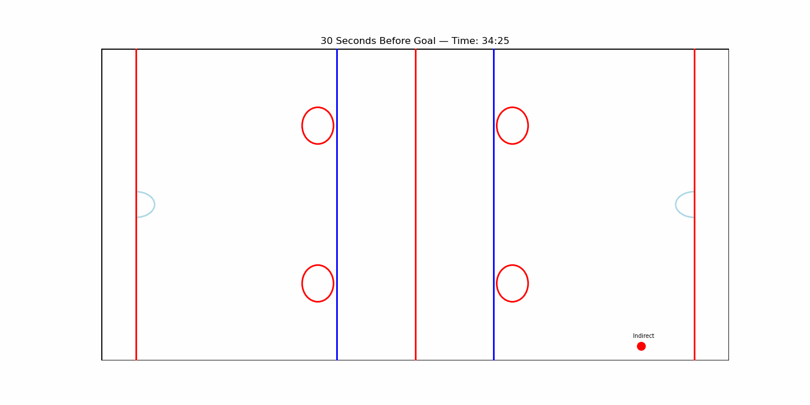
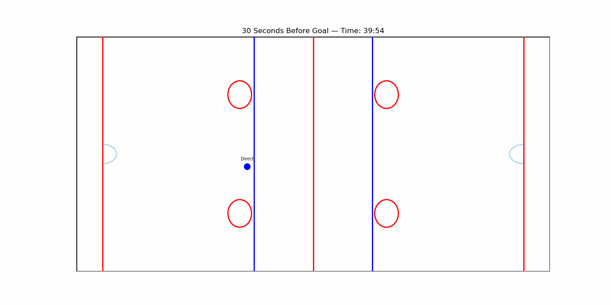

### Goal 1

The first goal is scored by Team Canada at 7:11 of the second period. The play begins in Canada's defensive zone, where the United States recovers the puck twice before making two direct passes deeper into Canada's zone. However, Canada wins back possession on the next pass and carries the puck over the blue line into the American zone. From there, Canada executes a series of give and go passes, drawing defenders out of position, which allows a Canadian player to advance closer to the net allowing them a sucessful scoring chance.

### Goal 2

The second goal is also scored by Team Canada at 14:54 of the second period, just 7:43 after the first. The sequence begins with a Canadian player gaining possession off the boards via an indirect pass, which leads to a direct pass to a teammate. Canada loses possession shortly after, sending the puck deep into their own defensive zone where the United States recovers. The Canadians win it back through an indirect pass, but immediately surrender possession via an American takeaway just beyond their own goal line. The United States capitalizes on the turnover, advancing into the Canadian zone and generating a high danger shot fortunately for the Canadians it is blocked. Canada clears the puck, transitions quickly into the offensive zone, leading to a scoring shot

### Goal 3

The final goal of the game is scored by Team USA during the third period 